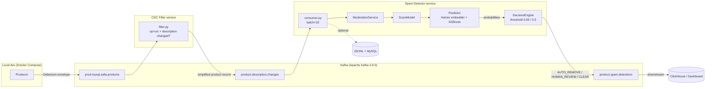

# Architecture & System Overview

## What the system does

classify_mahalli is a real-time product-listing moderation pipeline. It
monitors product updates from a MySQL database via Debezium Change Data Capture,
filters for listings whose description has changed, classifies them as spam or
legitimate using a multimodal XGBoost model, and publishes a three-tier decision —
`AUTO_REMOVE`, `HUMAN_REVIEW`, or `CLEAR` — to downstream systems.

---

## Major components

| Service | Responsibility |
|---|---|
| **Producer** | Generates synthetic Debezium CDC events for local development (replaced by a real Debezium MySQL connector in production) |
| **CDC Filter** | Consumes the raw CDC topic; passes through only records where the description field changed |
| **Spam Detector** | Embeds text with Harrier, runs XGBoost, applies threshold logic, publishes decision |
| **Monitor** | Reads both filter input and detector output; prints live throughput, latency, and efficiency stats |
| **Persistence** | Optional: writes detections to a JSONL file and/or a MySQL table |

---

## Data flow (Kafka streaming — dev/test)



---

## Component detail

### CDC Filter

Consumes `prod.mysql.salla.products`. Passes through a record only when:

1. `op` is `"u"` (update) or `"c"` (create), **and**
2. The description field changed or it is a new record.

Produces a slimmed message to `product.description.changes`:

```json
{ "product_id": 12345, "name": "...", "description": "..." }
```

This boundary means the embedding step only runs on listings where content actually
changed — keeping load proportional to content velocity rather than total MySQL
write volume.

### Spam Detector

Pulls batches of 32 messages. The internal call chain:

```
KafkaSingleConsumer
  └─ ModerationService.classify_scam_batch(items)
       └─ ScamModel.classify(items)
            ├─ text_utils.py  — clean, normalize Arabic, strip HTML/emoji
            ├─ Predictor.predict(texts)  — Harrier embedding → XGBoost probability
            └─ DecisionEngine.decide(prob)  — threshold → tier + action
```

#### Decision logic

```
prob >= 0.65  →  AUTO_REMOVE   (HIGH_RISK)
prob >= 0.5   →  HUMAN_REVIEW  (MEDIUM_RISK)
prob <  0.5   →  CLEAR         (LOW_RISK)
```

The rule-based PolicyEngine was prototyped but disabled after alignment with Salla —
see [Decision 007](../decisions/007-rule-engine-disabled.md).

---

## Mage.ai pipeline (Salla production)

After the Kafka streaming service was built, Salla requested the ML inference be
delivered as a **mage.ai pipeline** to plug into their production ML platform. The
mage pipeline runs the same two XGBoost models with weighted-average fusion but
operates as an orchestrated batch pipeline rather than an always-on Kafka consumer.

See [Decision 008](../decisions/008-mageai-pipeline.md) for context.

### Pipeline: `product_spam_detection`

```
embeddings_loader → batch_embeddings → xgboost → predictions
 (data_loader)      (transformer)      (transformer) (data_exporter)
```

| Block | What it does |
|---|---|
| `embeddings_loader` | Loads text + image embeddings per product from Salla's data source |
| `batch_embeddings` | Splits into batches of 256; passes both embedding arrays forward |
| `xgboost` | Runs two XGBoost models; blends `0.3 × text + 0.7 × image`; thresholds: AUTO_REMOVE ≥ 0.7, HUMAN_REVIEW ≥ 0.4 |
| `predictions` | Exports results to MySQL |

The Kafka pipeline serves as the development and testing environment. The mage.ai
pipeline is what Salla runs in production.

---

## Kafka topics

| Topic | Producer | Consumers | Format |
|---|---|---|---|
| `prod.mysql.salla.products` | Producer svc (or real Debezium) | CDC Filter, Monitor | Debezium CDC envelope |
| `product.description.changes` | CDC Filter | Spam Detector, Monitor | `{product_id, name, description}` |
| `product.spam.detections` | Spam Detector | ClickHouse / Dashboard | ClickHouse upsert envelope |

---

## Repository layout

```
classify_mahalli/
├── docker-compose.yml
├── requirements-ml.txt
├── requirements-service.txt
├── services/
│   ├── spam_detector/
│   │   ├── moderation_service.py
│   │   ├── predictor.py
│   │   ├── scamModel.py
│   │   ├── artifacts/XGBoost/
│   │   ├── configs/
│   │   ├── domain/
│   │   └── preprocessing/
│   └── cdc_filter/
│       └── filter.py
├── shared/
│   ├── consumer.py
│   ├── sql_handler.py
│   ├── monitor.py
│   └── producer/
└── [spam_pipeline]/          ← mage.ai pipeline (Salla production)
    ├── pipelines/product_spam_detection/
    ├── transformers/
    ├── data_loaders/
    └── data_exporters/
```
